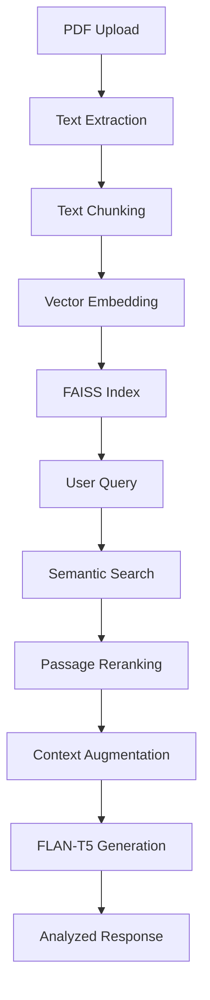

# 📖 SpectralReader - RAG-Powered Literary Analysis


SpectralReader leverages Retrieval-Augmented Generation (RAG) to deliver precise literary analysis by combining document retrieval with advanced language generation.

---

## 🧠 Core RAG Architecture

### Retrieval-Augmented Generation Pipeline

1. **Document Processing**:
   - PDF text extraction and cleaning
   - Semantic chunking with chapter awareness
   - Vector embeddings using MPNet

2. **Dual-Phase Retrieval**:
   - First-stage FAISS similarity search
   - Cross-encoder reranking for precision
   - Dynamic context window construction

3. **Augmented Generation**:
   - FLAN-T5 conditioned on retrieved passages
   - Confidence-scored responses
   - Character-focused prompt engineering

---

## ✨ Key RAG Features

- **Precision Retrieval**: Finds relevant passages even in long documents.
- **Context-Aware Generation**: Answers grounded in actual text.
- **Transparent Analysis**: Displays source passages for verification.
- **Adaptive Chunking**: Preserves literary structure (chapters, scenes).

---

## 🛠️ Enhanced Technology Stack

### RAG Components

| Component         | Purpose                       | Technology                  |
|-------------------|-------------------------------|-----------------------------|
| **Retriever**     | Finds relevant text passages  | FAISS + MPNet embeddings    |
| **Reranker**      | Improves passage relevance    | Cross-Encoder (MiniLM-L12)  |
| **Generator**     | Produces analytical responses | FLAN-T5 Large               |
| **Orchestration** | Manages RAG pipeline          | LangChain                   |

---

## 📊 Updated System Architecture



---

## 🤔 Why RAG for Literature?

1. **Accuracy**: Avoids hallucination by grounding answers in text.
2. **Transparency**: Shows retrieved passages supporting answers.
3. **Flexibility**: Handles diverse literary questions.
4. **Scalability**: Processes full novels efficiently.

---

## 🧪 Usage Example (RAG Flow)

```python
# Typical RAG operation in SpectralReader:

# 1. User asks a question:
question = "Who is the ghost in Canterville Chase?"

# 2. System retrieves 3 most relevant passages:
retrieved_passages = [
    "Sir Simon's tragic backstory from Chapter 2",
    "His haunting tactics described in Chapter 3",
    "Interactions with the Otis family in Chapter 5"
]

# 3. Generator synthesizes a response from these passages:
generated_answer = synthesize_response(retrieved_passages, question)

# 4. System outputs:
print(generated_answer)
# > "Sir Simon, the ghost haunting Canterville Chase, was once a nobleman condemned to roam the estate..."
```

---

## 📦 Updated requirements.txt

```text
# RAG-Specific Dependencies
faiss-cpu==1.7.4             # Vector similarity search
sentence-transformers==2.2.2 # Cross-encoders and embeddings
langchain==0.0.340           # RAG pipeline orchestration
```

---

## 🚀 What's Next?

- **Interactive Demo**: Live question answering over classic novels.
- **Chapter-Specific Analysis**: Deep dives into specific literary sections.
- **Multi-Document RAG**: Combine multiple books for comparative analysis.

---

> SpectralReader combines cutting-edge retrieval with generative AI to explore literature like never before.

