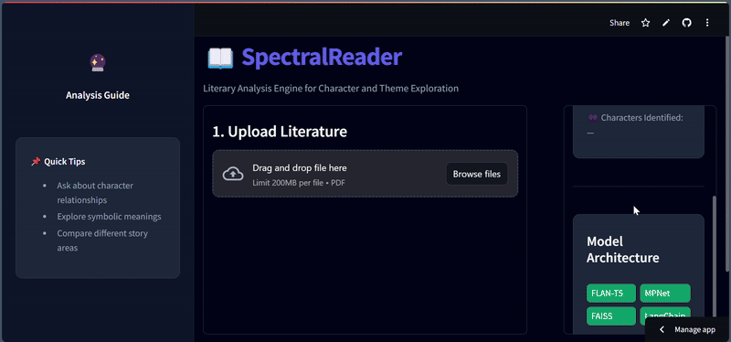
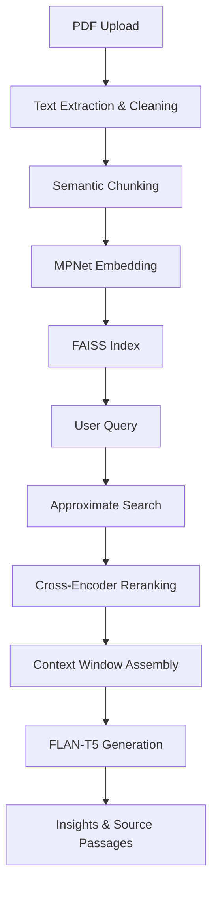

```markdown
# 📖 SpectralReader - Advanced Literary Analysis Engine

[Live Demo 🚀](https://parmindersinghgithub-spectralreader-appmain-4nyq8c.streamlit.app/)



SpectralReader is an AI‑powered literary analysis tool that specializes in character exploration, theme identification, and plot analysis for novels, plays, and short stories. Under the hood, it employs a **Retrieval‑Augmented Generation (RAG)** pipeline—combining semantic retrieval of relevant text passages with state‑of‑the‑art generative models—to deliver **accurate**, **transparent**, and **context‑aware** literary insights.

---

## ✨ Features

- **Character Analysis**: Identify and analyze characters with detailed profiles  
- **Theme Exploration**: Discover underlying themes and motifs  
- **Plot Insights**: Understand narrative structure and key events  
- **Contextual Understanding**: Deep comprehension of literary devices  
- **Transparent Sourcing**: See exactly which passages support each answer  
- **Real‑Time Monitoring**: Processing metrics and resource tracking  

---

## 🧠 Core RAG Architecture

SpectralReader’s RAG pipeline consists of three main phases:

1. **Document Processing**  
   - PDF text extraction & cleaning (via PDFplumber)  
   - Semantic chunking with chapter/scene boundaries  
   - Vector embeddings using MPNet sentence‑transformers  

2. **Dual‑Phase Retrieval**  
   - **Stage 1**: FAISS index for approximate nearest‑neighbour search  
   - **Stage 2**: Cross‑encoder (MiniLM‑L12) reranking for top‑k passage precision  
   - Dynamic context window assembly  

3. **Augmented Generation**  
   - FLAN‑T5 Large conditioned on retrieved & reranked passages  
   - Confidence scores for each response  
   - Prompt templates optimized for literary questions  

---

### 📊 RAG System Architecture



---

## 🛠️ Technology Stack

### Core RAG Components

| Component         | Purpose                          | Technology                       |
|-------------------|----------------------------------|----------------------------------|
| **Retriever**     | Approximate semantic search      | FAISS + MPNet embeddings         |
| **Reranker**      | Precision passage ranking        | Cross‑Encoder (MiniLM‑L12)       |
| **Generator**     | Context‑aware answer generation  | FLAN‑T5 Large                    |
| **Orchestration** | Pipeline management & tooling    | LangChain                        |

### Supporting Libraries & Tools

- **Streamlit**: Interactive web interface  
- **PDFplumber**: PDF text extraction  
- **Sentence‑Transformers**: Embeddings & cross‑encoders  
- **PyTorch**: Model inference  
- **Docker**: Containerized deployment (optional)  

---

## 🚀 Getting Started

### Prerequisites

- Python 3.8 or higher  
- `pip` package manager  

### Installation

```bash
git clone https://github.com/ParminderSinghGithub/SpectralReader.git
cd SpectralReader
cd app
pip install -r requirements.txt
```

### Run the Application

```bash
streamlit run main.py
```

---

## 🧪 Usage Guide

1. **Upload** your literary PDF document via the web UI  
2. System performs **semantic chunking** & **embeddings**  
3. **Ask questions** such as:  
   - **Characters**: “Who is the ghost in the story?”  
   - **Themes**: “What are the main themes in Chapter 3?”  
   - **Plot**: “Explain the significance of the climax scene”  
4. Explore the **detailed, sourced insights** generated by the AI  

---

## 📜 Requirements

See the complete dependency list in [requirements.txt](requirements.txt):


---

## 📜 License

Released under the **MIT License** — free for academic, personal, and commercial use.  
See [LICENSE](LICENSE) for details.
```