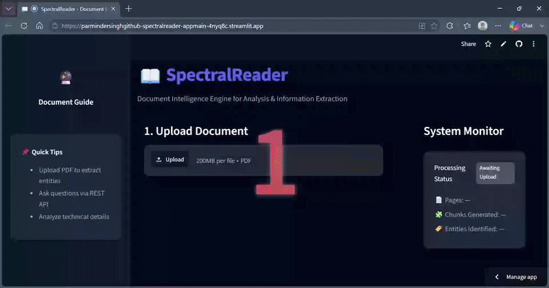
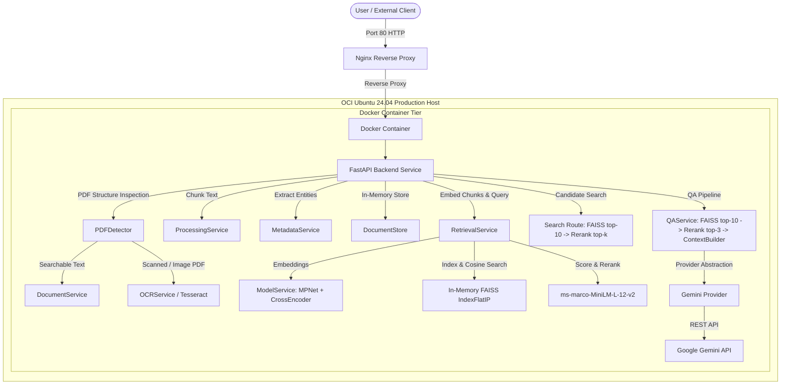

# 📖 SpectralReader - Document Intelligence Platform

[](https://www.python.org/)
[](https://fastapi.tiangolo.com/)
[](https://streamlit.io/)
[](https://www.docker.com/)
[](https://www.oracle.com/cloud/)
[](LICENSE)

**SpectralReader** is an AI-powered Document Intelligence platform designed for document understanding, PDF text extraction, entity recognition, semantic vector retrieval, cross-encoder reranking, and grounded question answering. Built with a modular Python backend powered by **FastAPI**, **in-memory FAISS**, and **Google Gemini**, it decouples document ingestion, automated Tesseract OCR, vector indexing, passage reranking, and provider-agnostic LLM generation from its interactive **Streamlit** user interface.

```text
Document Intelligence Platform
├── Digital PDF extraction (pdfplumber)
├── Scanned PDF OCR (Tesseract 5.5.0 + Poppler)
├── Resilient Gemini inference (3-tier 429 fallback)
└── Production RAG Pipeline
    ├── Sentence-transformer embeddings (paraphrase-multilingual-mpnet-base-v2)
    ├── In-memory FAISS vector retrieval (IndexFlatIP with normalized cosine similarity)
    ├── CrossEncoder reranking (ms-marco-MiniLM-L-12-v2)
    └── Grounded top-3 QA context (budgeted within ~4,000 chars)
```

---

## 🌐 Live Demo & API Documentation

- **Frontend Application (Streamlit):** [https://parmindersinghgithub-spectralreader-appmain-4nyq8c.streamlit.app](https://parmindersinghgithub-spectralreader-appmain-4nyq8c.streamlit.app)
- **Backend API Interactive Docs (Swagger UI):** [http://129.159.233.114/docs](http://129.159.233.114/docs)
- **OpenAPI 3.1 Specification (JSON):** [http://129.159.233.114/openapi.json](http://129.159.233.114/openapi.json)

--- 

## 🎥 Demo

<p align="center">
  
</p>

--- 

## 🎯 Why SpectralReader?

Unstructured text trapped in PDF documents—such as research papers, legal contracts, technical manuals, and corporate reports—is difficult to search and analyze efficiently. **SpectralReader** addresses this challenge by providing a structured Document Intelligence API and interactive client that extracts structural content, identifies key entities, automatically performs OCR on scanned documents, and answers natural language questions over document passages using a two-stage retrieval (FAISS dense vector search + CrossEncoder reranker) and generative LLMs.

### Key Engineering Concepts Demonstrated:
- **Clean Microservice Architecture**: Complete separation of UI presentation from backend logic, vector indexing, OCR, and model execution.
- **Production Two-Stage RAG Pipeline**: In-memory `faiss.IndexFlatIP` dense candidate retrieval (top-10) combined with `ms-marco-MiniLM-L-12-v2` CrossEncoder reranking (top-3), with strict per-document index isolation.
- **RESTful API Design**: Single source of truth API built with FastAPI, Pydantic validation, and OpenAPI specification.
- **Provider-Agnostic LLM Layer**: Decoupled LLM generation supporting Google Gemini with multi-tier model fallback (`gemini-3.1-flash-lite` primary -> `gemini-3.5-flash-lite` -> `gemini-3.6-flash`).
- **Automated PDF Structure Detection & OCR**: Inspection pipeline distinguishing searchable PDFs from scanned raster PDFs, automatically invoking Tesseract OCR only when required.
- **Deployment-Ready Engineering**: Environment-driven configurations, structured logging, multi-stage Docker builds with Tesseract/Poppler system binaries, Nginx reverse proxying, and production deployment on Oracle Cloud Infrastructure (OCI).

---

## 🏛️ System Architecture

SpectralReader uses a decoupled client-service architecture. In production on Oracle Cloud Infrastructure (OCI), an **Nginx** reverse proxy receives external client HTTP requests on Port 80 and forwards them to the **FastAPI Backend Service** running inside a container. The **Streamlit Web Application** functions as an interactive API client.

### Request Flow Topology
```
Internet
    │
Port 80 (HTTP)
    │
Nginx (Host Reverse Proxy)
    │
Local Container (spectralreader-api)
    │
FastAPI Backend Service ───► Google Gemini API (Generative QA)
    │
ML Model Infrastructure & Tesseract OCR Engine
```

### Microservice Architecture Diagram

```mermaid
graph TD
    Client([User / External Client]) -->|Port 80 HTTP| Nginx[Nginx Reverse Proxy]
    Nginx -->|Reverse Proxy| Docker[Docker Container]

    subgraph OCI Ubuntu 24.04 Production Host
        subgraph Docker Container Tier
            Docker --> API[FastAPI Backend Service]
            API -->|PDF Structure Inspection| Detector[PDFDetector]
            Detector -->|Searchable Text| DocService[DocumentService]
            Detector -->|Scanned / Image PDF| OCRService[OCRService / Tesseract]
            API -->|Chunk Text| ProcService[ProcessingService]
            API -->|Extract Entities| MetaService[MetadataService]
            API -->|In-Memory Store| Storage[DocumentStore]
            
            %% Production RAG Subsystem
            API -->|Embed Chunks & Query| Retrieval[RetrievalService]
            Retrieval -->|Embeddings| ModelContainer[ModelService: MPNet + CrossEncoder]
            Retrieval -->|Index & Cosine Search| FAISS[In-Memory FAISS IndexFlatIP]
            Retrieval -->|Score & Rerank| CrossEncoder[ms-marco-MiniLM-L-12-v2]
            
            API -->|Candidate Search| SearchAPI[Search Route: FAISS top-10 -> Rerank top-k]
            API -->|QA Pipeline| QAService[QAService: FAISS top-10 -> Rerank top-3 -> ContextBuilder]
            
            QAService -->|Provider Abstraction| GeminiProvider[Gemini Provider]
            GeminiProvider -->|REST API| GeminiAPI[Google Gemini API]
        end
    end
```

---

## 💡 Architecture Decisions

- **FastAPI as Core Backend**: High-performance asynchronous REST microservice featuring automatic Pydantic request/response validation and native OpenAPI/Swagger specification.
- **Production In-Memory FAISS Vector Indexing**: Document chunks are embedded with `sentence-transformers/paraphrase-multilingual-mpnet-base-v2` and indexed using `faiss.IndexFlatIP`. Chunks are L2-normalized so inner product equals exact cosine similarity.
- **Strict Document Isolation**: Each document maintains its own dedicated in-memory FAISS index and chunk lookup map. Queries against document A never leak or search across document B chunks.
- **Two-Stage Retrieval & CrossEncoder Reranking**: First stage performs dense vector retrieval pulling top-10 candidates; second stage evaluates query-passage pairs with `cross-encoder/ms-marco-MiniLM-L-12-v2` to select the top-3 most semantically relevant passages.
- **Grounded Context Selection**: QAService grounds generation strictly in the top-3 reranked passages, budgeted within ~4,000 characters. The LLM does not receive the entire document merely because it fits within the context window.
- **Zero Architectural Bloat**: FAISS is kept in-memory for the application lifecycle. No persistent vector database, and no orchestration layers (LangChain/LangGraph/AutoGen/LlamaIndex) were introduced into the core retrieval path.
- **Nginx as Host Reverse Proxy**: Standard production entry point managing public HTTP traffic on Port 80 and proxying to the local containerized backend service.
- **Streamlit as Official Frontend**: Streamlit provides a responsive interface for document uploads and interactive analysis without adding complex frontend JavaScript build pipelines.
- **Backend as Single Source of Truth**: All PDF parsing, OCR detection, chunking, vector indexing, reranking, and Gemini QA generation reside strictly within backend services.
- **Provider-Agnostic LLM Layer**: Generative QA is decoupled into an extensible provider abstraction interface (`BaseLLMProvider`). The current active provider is Google Gemini, configured with 3-tier model fallback (`gemini-3.1-flash-lite` primary -> `gemini-3.5-flash-lite` -> `gemini-3.6-flash`) triggering on HTTP 429 rate limit errors.
- **External System Integration**: Decoupling business logic into REST endpoints enables external systems (mobile apps, CLI tools, automated batch pipelines) to consume the service independently.

> 📜 **Architecture Evolution Note**:
> Earlier versions of SpectralReader used FLAN-T5-Large for local generation and naive entity-presence passage matching. The current production architecture features a two-stage RAG pipeline (in-memory FAISS + CrossEncoder reranking), Google Gemini with 3-tier model fallback, and automated Tesseract OCR for scanned PDF documents.

---

## 📑 Automated OCR Workflow

SpectralReader automatically inspects uploaded PDF documents to determine whether they contain native text streams or raster scanned images:

```
Uploaded PDF Document
         │
PDF Structure Inspection (PDFDetector)
         ├──────────────────────────────────────────┐
         ▼                                          ▼
Searchable Text PDF                        Scanned / Image PDF
(pdfplumber Native Parser)                  (Tesseract OCR + Poppler)
         │                                          │
         └────────────────────┬─────────────────────┘
                              ▼
                 Text Cleaning & Chunking
                              │
                 Entity Extraction & Storage
                              │
                 Context Budgeting & Deduplication
                              │
                 Gemini Generative QA Response
```

* **Automated Detection**: The backend `PDFDetector` inspects char counts per page. Searchable PDFs pass through native text extraction without OCR overhead.
* **No User Selection Needed**: Users do not manually select OCR mode; the system detects and routes scanned PDFs automatically.
* **Production Container Support**: Tesseract 5.5.0 and Poppler utilities (`pdftoppm`) are compiled and packaged into the multi-stage Docker production image.

---

## ✨ Features

- 📄 **PDF Text Extraction & Structure Detection**: Automated inspection separating searchable PDFs (`pdfplumber`) from scanned raster PDFs (`Tesseract OCR` + `pdf2image`).
- 🔍 **Automatic OCR Engine**: Integrated Tesseract 5.5.0 and Poppler inside Docker for seamless scanned PDF processing without manual user selection.
- 🧩 **Semantic Text Chunking**: Boundary-aware document splitting with configurable chunk sizes (1500 chars) and overlap limits (300 chars).
- 🏷️ **Entity Metadata Recognition**: Pattern-based entity extraction and frequency analysis.
- 🎯 **Semantic Passage Search**: Two-stage retrieval combining in-memory FAISS dense vector search (`IndexFlatIP` top-10) and CrossEncoder reranking (`ms-marco-MiniLM-L-12-v2` top-k) returning rich results with scores and chunk metadata.
- 🧠 **Production Two-Stage RAG**: Chunks embedded immediately upon upload using `paraphrase-multilingual-mpnet-base-v2`, strictly isolated per document, reranked to top-3 passages, and context-budgeted (~4,000 chars) for Gemini answer generation.
- 📊 **Retrieval Evaluation Benchmark**: Integrated evaluation suite (`validation/rag_eval.py` + `golden_questions.yaml`) measuring Recall@3 and MRR across 7 representative project PDFs.
- ⚡ **REST Microservice**: Standardized JSON responses, Pydantic data validation, and global exception handling.
- 📊 **Health Probes & Metrics**: `/health` endpoint reporting active LLM provider, vector model status, OCR engine availability, and `X-Process-Time` timing headers.

---

## 🛠️ Technology Stack

| Category | Technology Used | Description |
| :--- | :--- | :--- |
| **Cloud Infrastructure** | Oracle Cloud Infrastructure (OCI) | Production hosting platform (Ubuntu 24.04 LTS VM) |
| **Reverse Proxy** | Nginx | Host reverse proxy routing public HTTP traffic to backend container |
| **Backend Framework** | FastAPI | REST API routing and OpenAPI generation |
| **Frontend Interface** | Streamlit | Interactive web user interface client |
| **LLM Provider** | Google Gemini (`gemini-3.1-flash-lite`) | Generative question answering with 3-tier 429 fallback (`3.5-flash-lite`, `3.6-flash`) |
| **Vector Retrieval Index** | FAISS CPU (`IndexFlatIP`) | In-memory cosine similarity dense candidate retrieval with strict per-document isolation |
| **Embedding Model** | `paraphrase-multilingual-mpnet-base-v2` | Pre-warmed sentence-transformers embeddings loaded in memory |
| **Reranker Model** | `ms-marco-MiniLM-L-12-v2` | Pre-warmed CrossEncoder scoring query-passage candidate pairs |
| **OCR Engine** | Tesseract 5.5.0, Poppler, `pdf2image` | Automatic text extraction for scanned raster PDF documents |
| **Document Processing** | `pdfplumber`, LangChain Text Splitters | Native PDF text extraction, structure detection, and recursive chunking |
| **API & Data Validation**| Pydantic, Python-Multipart | Schema validation and multipart file upload handling |
| **Containerization** | Docker, Docker Compose | Multi-stage container builds with pre-packaged Tesseract/Poppler binaries |
| **Testing Suite** | Pytest (47 tests), Pytest-Cov, HTTPX | Automated unit, integration, and live-path RAG validation suite |

---

## 📂 Repository Structure

```
SpectralReader/
├── Dockerfile                  # Multi-stage Docker build container (Python 3.12 + Tesseract/Poppler)
├── .dockerignore               # Docker context exclusion rules
├── docker-compose.yml          # Production container orchestration file
├── .env.example                # Deployment environment variable template
├── LICENSE                     # MIT License
├── README.md                   # Platform documentation & production guide
├── app/                        # Application source code
│   ├── main_api.py             # FastAPI backend entry point
│   ├── main.py                 # Streamlit frontend client entry point
│   ├── requirements.txt        # Python dependency manifest
│   ├── api/                    # REST API Endpoint Routers (health, documents, search, qa)
│   ├── core/                   # Infrastructure Core (config, logger, exceptions)
│   ├── llm/                    # Provider-agnostic LLM interface & Gemini implementation
│   ├── ocr/                    # PDF structure detector & Tesseract OCR engine
│   ├── models/                 # Pydantic Schemas (request & response models)
│   ├── services/               # Backend Business Logic (retrieval, document, processing, metadata, model, qa)
│   │   ├── retrieval_service.py # In-memory FAISS indexing, candidate retrieval, CrossEncoder reranking
│   │   ├── model_service.py    # Pre-warmed embedding and CrossEncoder singleton
│   │   └── qa_service.py       # Grounded QA orchestration (retrieval -> rerank -> budget -> Gemini)
│   └── storage/                # In-memory document storage
├── tests/                      # Automated Pytest Suite (47 tests passing)
│   ├── conftest.py             # Shared pytest fixtures & ML mocks
│   ├── unit/                   # Service unit tests & retrieval live-path verification
│   │   └── test_retrieval_service.py # 11 tests: FAISS indexing, isolation, reranking, QA live path
│   └── api/                    # API integration tests (documents, health, qa, search)
└── validation/                 # Automated End-to-End Validation & RAG Evaluation Framework
    ├── golden_questions.yaml   # 15 ground-truth Q/A/context triples across 7 PDFs
    ├── rag_eval.py             # RAG retrieval benchmark (Recall@3 and MRR ablation comparison)
    ├── validate.py             # E2E test runner CLI
    ├── configs/                # Validation test cases (YAML)
    └── reports/                # Validation reports & HTTP archives
```

---

## 🚀 Local Setup & Execution

### Prerequisites
- Python 3.12 or higher
- `pip` package manager
- System OCR dependencies (optional for local non-Docker OCR testing: Tesseract OCR and Poppler)

### 1. Installation
```bash
git clone https://github.com/ParminderSinghGithub/SpectralReader.git
cd SpectralReader
python -m venv venv

# On Windows
.\venv\Scripts\activate

# On Linux/macOS
source venv/bin/activate

pip install -r app/requirements.txt
```

### 2. Launch FastAPI Backend Service
```bash
uvicorn app.main_api:app --reload --host 0.0.0.0 --port 8000
```
The REST API will be accessible at `http://localhost:8000`.  
View interactive Swagger documentation at `http://localhost:8000/docs` and ReDoc at `http://localhost:8000/redoc`.

### 3. Launch Streamlit Frontend Client
In a separate terminal window:
```bash
# On Windows
.\venv\Scripts\activate

streamlit run app/main.py
```
The Streamlit interface will open at `http://localhost:8501`.

---

## 🐳 Docker Setup

### 1. Build and Run Container Locally
```bash
docker build -t spectralreader-api .
docker run -p 8000:8000 -e PORT=8000 --env-file .env spectralreader-api
```

### 2. Using Docker Compose
```bash
docker-compose up --build
```
Executes container health checks targeting `http://localhost:8000/health`.

---

## 🌐 Production Deployment Overview (OCI)

SpectralReader is deployed in production on **Oracle Cloud Infrastructure (OCI)** using an Ubuntu 24.04 LTS Compute VM.

### Deployment Architecture Highlights
1. **Infrastructure & Networking**:
   - Hosted on an OCI Public Subnet VM running Ubuntu 24.04 LTS.
   - OCI networking and firewall rules are configured to allow public HTTP access.
2. **Container Management**:
   - Deployed and orchestrated using Docker Compose.
   - Docker Compose exposes the backend service locally on the host.
   - Generative QA uses Gemini REST endpoints driven by the `GEMINI_API_KEY` environment variable.
3. **Nginx Reverse Proxy**:
   - Nginx acts as the reverse proxy for incoming HTTP requests to the backend service.
   - Standard proxy headers and body size limits are configured to support PDF uploads.

### 📜 Historical Deployment Note
Previously, the FastAPI backend was hosted on Render (`spectralreader-api.onrender.com`). The backend deployment was transitioned to Oracle Cloud Infrastructure (OCI) with Docker Compose and Nginx for dedicated infrastructure control, persistent model caching, and improved inference performance.

---

## ⚙️ Environment Variables Reference

| Variable | Type | Default | Requirement | Description |
| :--- | :--- | :--- | :--- | :--- |
| `HOST` | String | `0.0.0.0` | Required | IP binding interface address for Uvicorn server |
| `PORT` | Integer | `8000` | Required | HTTP port exposed by backend service |
| `LOG_LEVEL` | String | `INFO` | Required | Logger verbosity (`DEBUG`, `INFO`, `WARNING`, `ERROR`) |
| `API_BASE_URL` | String | `http://localhost:8000` | Required | Base URL used by FastAPI backend service |
| `STREAMLIT_BACKEND_URL` | String | `http://localhost:8000` | Required | Target backend URL used by Streamlit client |
| `CORS_ORIGINS` | String | `*` | Required | Allowed CORS origins (comma-separated list) |
| `LLM_PROVIDER` | String | `gemini` | Required | Active generative LLM provider (`gemini`) |
| `GEMINI_API_KEY` | String | None | Required for QA | Google Gemini REST API authentication key |
| `GEMINI_DEFAULT_MODEL` | String | `gemini-3.1-flash-lite` | Optional | Primary Google Gemini model for generative question answering |
| `GEMINI_FALLBACK_MODELS` | String | `gemini-3.5-flash-lite,gemini-3.6-flash` | Optional | Ordered fallback models triggered sequentially on HTTP 429 quota limit |
| `ENABLE_OCR` | Boolean | `true` | Optional | Master toggle to enable/disable automated OCR for scanned PDFs |
| `OCR_PROVIDER` | String | `tesseract` | Optional | Active OCR engine implementation (`tesseract`) |
| `OCR_MIN_TEXT_CHARS_PER_PAGE` | Integer | `50` | Optional | Character threshold per page to distinguish searchable vs scanned image PDFs |
| `HF_TOKEN` | String | None | Optional | Hugging Face User Access Token for gated embedding models |
| `MODEL_CACHE_DIR` | String | None | Optional | Host volume directory path for caching downloaded HF models |

---

## 📡 REST API Reference & Public Endpoints

The FastAPI backend exposes interactive OpenAPI documentation and standardized REST endpoints:

- **Swagger UI Documentation**: `http://<PUBLIC_HOST>/docs`
- **OpenAPI Specification JSON**: `http://<PUBLIC_HOST>/openapi.json`
- **Health Check Endpoint**: `http://<PUBLIC_HOST>/health`

### 1. Health Check
```bash
curl -X GET "http://localhost:8000/health"
```
**Example Response**:
```json
{
  "status": "ok",
  "service": "SpectralReader Document Intelligence API",
  "version": "1.1.0",
  "models_loaded": true,
  "components": {
    "embedding_model": {
      "status": "loaded",
      "model": "sentence-transformers/paraphrase-multilingual-mpnet-base-v2"
    },
    "reranker_model": {
      "status": "loaded",
      "model": "cross-encoder/ms-marco-MiniLM-L-12-v2"
    },
    "active_llm_provider": {
      "name": "gemini",
      "model": "gemini-3.1-flash-lite",
      "available": true
    },
    "ocr_provider": {
      "name": "tesseract",
      "enabled": true,
      "available": true
    }
  }
}
```

### 2. Upload Document
```bash
curl -X POST "http://localhost:8000/documents" \
  -F "file=@/path/to/document.pdf"
```
**Example Response**:
```json
{
  "document_id": "a1b2c3d4-e5f6-7890-abcd-ef1234567890",
  "filename": "sample_document.pdf",
  "num_pages": 12,
  "num_chunks": 34,
  "entities": ["Executive Summary", "Financial Growth"],
  "is_scanned": false,
  "ocr_used": false,
  "created_at": "2026-08-12T20:00:00.000000"
}
```

### 3. Get Document Metadata
```bash
curl -X GET "http://localhost:8000/documents/<document_id>"
```

### 4. Search Candidate Passages
Retrieves candidate passages using two-stage semantic vector retrieval and reranking:
1. Embeds query with `paraphrase-multilingual-mpnet-base-v2` and searches the document's in-memory `faiss.IndexFlatIP` for top-10 candidate chunks.
2. Scores and reranks candidate pairs using CrossEncoder (`ms-marco-MiniLM-L-12-v2`).
3. Returns top-k passages with `chunk_id`, `text`, and `score`.

```bash
curl -X POST "http://localhost:8000/search" \
  -H "Content-Type: application/json" \
  -d '{
    "document_id": "<document_id>",
    "query": "What are the primary findings?",
    "top_k": 3
  }'
```
**Example Response**:
```json
{
  "document_id": "a1b2c3d4-e5f6-7890-abcd-ef1234567890",
  "query": "What are the primary findings?",
  "results": [
    {
      "chunk_id": "a1b2c3d4-e5f6-7890-abcd-ef1234567890_0",
      "text": "Executive Summary passage containing key findings...",
      "score": 4.821,
      "dense_score": 0.812
    },
    {
      "chunk_id": "a1b2c3d4-e5f6-7890-abcd-ef1234567890_4",
      "text": "Quarterly revenue expanded by 18% during fiscal year...",
      "score": 3.105,
      "dense_score": 0.745
    }
  ]
}
```

### 5. Generative Question Answering
Executes two-stage RAG question answering over document chunks:
1. Dense candidate retrieval via FAISS (`IndexFlatIP`, top-10).
2. CrossEncoder reranking (`ms-marco-MiniLM-L-12-v2`, top-3).
3. Context budgeting and deduplication (~4,000 characters).
4. Prompt rendering and answer synthesis via Google Gemini with 3-tier model fallback.

```bash
curl -X POST "http://localhost:8000/qa" \
  -H "Content-Type: application/json" \
  -d '{
    "document_id": "<document_id>",
    "question": "What is the primary conclusion of the report?"
  }'
```
**Example Response**:
```json
{
  "document_id": "a1b2c3d4-e5f6-7890-abcd-ef1234567890",
  "question": "What is the primary conclusion of the report?",
  "answer": "The report concludes that quarterly revenue expanded by 18%.",
  "retrieved_context": ["Quarterly financial overview passage..."],
  "processing_time_ms": 142.5,
  "llm_provider": "gemini",
  "model_name": "gemini-3.1-flash-lite"
}
```

### 6. Delete Document
```bash
curl -X DELETE "http://localhost:8000/documents/<document_id>"
```

---

## 📊 Retrieval Evaluation Benchmark

SpectralReader includes a dedicated retrieval evaluation benchmark (`validation/rag_eval.py` and `validation/golden_questions.yaml`) measuring retrieval accuracy across **15 ground-truth question/context/answer triples** on **7 representative project PDFs** (`attention_is_all_you_need.pdf`, `2025_AnnualReport.pdf`, `the_canterville_ghost.pdf`, `sample-100pages.pdf`, `sample-1000pages.pdf`, `test_ocr.pdf`, `empty.pdf`).

### Verified Evaluation Results

| Retrieval Method | Recall@3 | MRR (Mean Reciprocal Rank) | Relative Gain |
| :--- | :---: | :---: | :---: |
| **Keyword Baseline (Pre-RAG)** | 33.3% | 0.372 | Baseline |
| **Dense FAISS** | 46.7% | 0.450 | +40.2% Recall / +21.0% MRR |
| **Dense FAISS + CrossEncoder** | **60.0%** | **0.533** | **+80.0% Recall@3 / +43.3% MRR** |

Execute the evaluation benchmark locally:
```bash
python validation/rag_eval.py
```

---

## 🧪 Deployment Verification

Docker build and local container runtime were verified successfully:
- Multi-stage Docker image built cleanly (`docker build -t spectralreader-api .`).
- Container runtime verified on port 8000 with pre-warmed vector models (`paraphrase-multilingual-mpnet-base-v2` and `ms-marco-MiniLM-L-12-v2`).
- Health probes return HTTP 200 with `models_loaded: true`.

To verify a production deployment on OCI:

1. **Check Container Status**:
   Run `docker compose ps` to ensure the `spectralreader-api` container is running and healthy.
2. **Local Health Probe**:
   Run `curl -f http://localhost:8000/health` to confirm the backend service reports `"status": "ok"` and component provider status.
3. **Public Reverse Proxy Probe**:
   Run `curl -f http://<PUBLIC_HOST>/health` to confirm Nginx correctly routes external Port 80 traffic to the backend.
4. **Interactive Swagger Documentation**:
   Navigate to `http://<PUBLIC_HOST>/docs` in a web browser to verify interactive API documentation rendering.
5. **OpenAPI Schema Verification**:
   Access `http://<PUBLIC_HOST>/openapi.json` to verify the OpenAPI JSON specification download.

---

## 🔧 Troubleshooting Common Production Issues

| Issue / Symptom | Possible Cause | Recommended Solution |
| :--- | :--- | :--- |
| **Gemini API Key missing / 401 Unauthorized** | Missing `GEMINI_API_KEY` in environment | Set a valid Google Gemini API Key in `.env`. |
| **Container crashes on startup / Out of Memory** | Insufficient host system RAM during model pre-warming | Allocate at least 4GB RAM or add swap memory on the OCI VM host. |
| **Nginx 502 Bad Gateway** | FastAPI container is down or not listening locally | Verify container status with `docker compose ps` and inspect container logs. |
| **Public Host Connection Refused / Timeout** | OCI Security List or host firewall blocking Port 80 | Configure OCI networking and host firewall rules to allow traffic on Port 80. |
| **HTTP 413 Payload Too Large on PDF Upload** | Nginx client body size limit reached | Increase client body size limit in Nginx site configuration. |

---

## 🧪 Automated Testing

Execute the comprehensive 47-test suite with coverage reporting:
```bash
pytest tests/ -v --cov=app --cov-report=term-missing
```

### Testing Strategy
- **47 Tests Passing**: 36 existing tests covering core document services, storage handlers, schema validation, OCR detection, LLM fallback, and REST API endpoints + 11 new tests covering vector indexing, cosine similarity, document isolation, CrossEncoder reranking, edge cases, and QA live-path integration.
- **QA Live-Path Verification**: Integration test verifies that when `document_id` is supplied, QA strictly executes `FAISS (top-10) -> CrossEncoder (top-3) -> ContextBuilder (~4,000 char budget)`, proving the full document chunk set is never fed directly to Gemini.
- **ML Dependency Isolation**: Heavy model downloads and external REST API calls are mocked using `pytest` fixtures, allowing the test suite to execute deterministically in ~1 second.

---

## 🧪 Automated End-to-End Validation

SpectralReader includes a dedicated end-to-end validation framework under `validation/`.

It automatically validates uploads, metadata extraction, search, Gemini question answering, deletion workflows, edge cases, OCR execution, performance metrics, and deployment readiness across multiple document types.

Run validation:
```bash
python validation/validate.py --backend-url http://localhost:8000
```
See: [Validation README](validation/README.md)

---

## 🗺️ Roadmap & Future Enhancements

- 🗄️ **Persistent Document Storage**: Transition from in-memory storage to PostgreSQL or SQLite.
- 🔍 **Distributed Vector Database**: Optional persistent storage in Qdrant or Milvus for large multi-node clusters (in addition to current in-memory FAISS).
- 📑 **Advanced OCR Extensions**: Multi-engine OCR fallback (e.g. AWS Textract or EasyOCR).
- 🔒 **Authentication & Authorization**: Add API key management and JWT user authentication.
- 📦 **Cloud Object Storage**: Store uploaded PDF binaries in AWS S3 or Oracle Object Storage.
- 📚 **Multi-Document Retrieval**: Enable query execution across multiple documents simultaneously.
- ⚡ **Background Processing**: Offload heavy document ingestion tasks to Celery / Redis workers.

---

## 📜 License

Released under the **MIT License** — free for academic, personal, and commercial use. See [LICENSE](LICENSE) for details.
