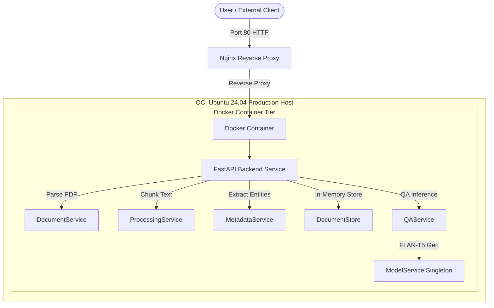

# 📖 SpectralReader - Document Intelligence Platform

[](https://www.python.org/)
[](https://fastapi.tiangolo.com/)
[](https://streamlit.io/)
[](https://www.docker.com/)
[](https://www.oracle.com/cloud/)
[](LICENSE)

**SpectralReader** is an AI-powered Document Intelligence application designed for document understanding, PDF text extraction, entity metadata recognition, passage retrieval, and context-aware question answering. Built with a modular Python backend powered by **FastAPI** and **FLAN-T5**, it decouples machine learning inference and document processing from its interactive **Streamlit** user interface.

---

## 🎯 Why SpectralReader?

Unstructured text trapped in PDF documents—such as research papers, legal contracts, technical manuals, and corporate reports—is difficult to search and analyze efficiently. **SpectralReader** addresses this challenge by providing a structured Document Intelligence API and interactive client that extracts structural content, identifies key entities, and answers natural language questions over document passages.

### Key Engineering Concepts Demonstrated:
- **Clean Microservice Architecture**: Complete separation of UI presentation from backend logic, data parsing, and model execution.
- **RESTful API Design**: Single source of truth API built with FastAPI, Pydantic validation, and OpenAPI specification.
- **ML Dependency Isolation**: Decoupled model lifecycle management with fast, deterministic unit/integration testing via dependency mocking.
- **Deployment-Ready Engineering**: Environment-driven configurations, structured logging, multi-stage Docker builds, Nginx reverse proxying, and production deployment on Oracle Cloud Infrastructure (OCI).

---

## 🏛️ System Architecture

SpectralReader uses a decoupled client-service architecture. In production on Oracle Cloud Infrastructure (OCI), an **Nginx** reverse proxy receives external client HTTP requests on Port 80 and forwards them to the **FastAPI Backend Service** running inside a container. The **Streamlit Web Application** functions as an interactive API client.

### Request Flow Topology
```
Internet
    │
Port 80 (HTTP)
    │
Nginx (Host Reverse Proxy)
    │
Local Container (spectralreader-api)
    │
FastAPI Backend Service
    │
ML Models (FLAN-T5 & Embeddings)
```

### Microservice Architecture Diagram

```mermaid
graph TD
    Client([User / External Client]) -->|Port 80 HTTP| Nginx[Nginx Reverse Proxy]
    Nginx -->|Reverse Proxy| Docker[Docker Container]

    subgraph OCI Ubuntu 24.04 Production Host
        subgraph Docker Container Tier
            Docker --> API[FastAPI Backend Service]
            API -->|Parse PDF| DocService[DocumentService]
            API -->|Chunk Text| ProcService[ProcessingService]
            API -->|Extract Entities| MetaService[MetadataService]
            API -->|In-Memory Store| Storage[DocumentStore]
            API -->|QA Inference| QAService[QAService]
            
            QAService -->|FLAN-T5 Gen| Models[ModelService Singleton]
        end
    end
```

---

## 💡 Architecture Decisions

- **FastAPI as Core Backend**: Chosen for high performance, automatic Pydantic request/response validation, native OpenAPI/Swagger generation, and clean asynchronous request routing.
- **Nginx as Host Reverse Proxy**: Standard production entry point managing public HTTP traffic on Port 80 and proxying to the local containerized backend service.
- **Streamlit as Official Frontend**: Streamlit provides a responsive interface for document uploads and interactive analysis without adding complex frontend JavaScript build pipelines.
- **Backend as Single Source of Truth**: All PDF parsing, text cleaning, chunking, entity extraction, model loading, and QA generation reside strictly within backend services.
- **Exclusive REST API Communication**: The Streamlit client communicates with the backend exclusively over HTTP REST endpoints. If the backend is offline, Streamlit prompts the operator to start the server rather than silently running local in-process fallbacks.
- **External System Integration**: Decoupling business logic into REST endpoints enables external systems (mobile apps, CLI tools, automated batch pipelines) to consume the service independently.

---

## ✨ Features

- 📄 **PDF Text Extraction**: Page-level text parsing using `pdfplumber`.
- 🧩 **Semantic Text Chunking**: Boundary-aware document splitting with configurable chunk sizes and overlap limits.
- 🏷️ **Entity Metadata Recognition**: Pattern-based entity extraction and frequency analysis.
- 🔍 **Passage Retrieval & Search**: Candidate passage filtering across document chunks.
- 🧠 **Context-Aware Question Answering**: Generative answer synthesis using FLAN-T5-Large.
- ⚡ **REST Microservice**: Standardized JSON responses, Pydantic data validation, and global exception handling.
- 📊 **Health Probes & Metrics**: `/health` endpoint and `X-Process-Time` request timing headers.

---

## 🛠️ Technology Stack

| Category | Technology Used | Description |
| :--- | :--- | :--- |
| **Cloud Infrastructure** | Oracle Cloud Infrastructure (OCI) | Production hosting platform (Ubuntu 24.04 LTS VM) |
| **Reverse Proxy** | Nginx | Host reverse proxy routing public HTTP traffic to backend container |
| **Backend Framework** | FastAPI | REST API routing and OpenAPI generation |
| **Frontend Interface** | Streamlit | Interactive web user interface client |
| **NLP & Language Models** | FLAN-T5-Large | Seq2Seq generative question answering |
| **Model Hub & Auth** | Hugging Face Hub | Model storage and `HF_TOKEN` access authentication |
| **Document Processing** | `pdfplumber`, LangChain | PDF text extraction and recursive text splitting |
| **ML Framework** | PyTorch, Hugging Face | Model inference and execution |
| **API & Data Validation**| Pydantic, Python-Multipart | Schema validation and file upload handling |
| **Containerization** | Docker, Docker Compose | Multi-stage container builds and persistent volume cache |
| **Testing Suite** | Pytest, Pytest-Cov, HTTPX | Automated unit, integration, and E2E validation |

---

## 📂 Repository Structure

```
SpectralReader/
├── Dockerfile                  # Multi-stage Docker build container
├── .dockerignore               # Docker context exclusion rules
├── docker-compose.yml          # Production container orchestration file
├── .env.example                # Deployment environment variable template
├── LICENSE                     # MIT License
├── README.md                   # Platform documentation & production guide
├── app/                        # Application source code
│   ├── main_api.py             # FastAPI backend entry point
│   ├── main.py                 # Streamlit frontend client entry point
│   ├── requirements.txt        # Python dependency manifest
│   ├── api/                    # REST API Endpoint Routers
│   ├── core/                   # Infrastructure Core (config, logger, exceptions)
│   ├── models/                 # Pydantic Schemas (request & response models)
│   ├── services/               # Backend Business Logic (document, processing, metadata, model, qa)
│   └── storage/                # In-memory document storage
├── tests/                      # Automated Pytest Suite
│   ├── conftest.py             # Shared pytest fixtures & ML mocks
│   ├── unit/                   # Service unit tests
│   └── api/                    # API integration tests
└── validation/                 # Automated End-to-End Validation Framework
    ├── validate.py             # E2E test runner CLI
    ├── configs/                # Validation test cases
    └── reports/                # Validation reports & HTTP archives
```

---

## 🚀 Local Setup & Execution

### Prerequisites
- Python 3.12 or higher
- `pip` package manager

### 1. Installation
```bash
git clone https://github.com/ParminderSinghGithub/SpectralReader.git
cd SpectralReader
python -m venv venv

# On Windows
.\venv\Scripts\activate

# On Linux/macOS
source venv/bin/activate

pip install -r app/requirements.txt
```

### 2. Launch FastAPI Backend Service
```bash
uvicorn app.main_api:app --reload --host 0.0.0.0 --port 8000
```
The REST API will be accessible at `http://localhost:8000`.  
View interactive Swagger documentation at `http://localhost:8000/docs` and ReDoc at `http://localhost:8000/redoc`.

### 3. Launch Streamlit Frontend Client
In a separate terminal window:
```bash
# On Windows
.\venv\Scripts\activate

streamlit run app/main.py
```
The Streamlit interface will open at `http://localhost:8501`.

---

## 🐳 Docker Setup

### 1. Build and Run Container Locally
```bash
docker build -t spectralreader-api .
docker run -p 8000:8000 -e PORT=8000 spectralreader-api
```

### 2. Using Docker Compose
```bash
docker-compose up --build
```
Executes container health checks targeting `http://localhost:8000/health`.

---

## 🌐 Production Deployment Overview (OCI)

SpectralReader is deployed in production on **Oracle Cloud Infrastructure (OCI)** using an Ubuntu 24.04 LTS Compute VM.

### Deployment Architecture Highlights
1. **Infrastructure & Networking**:
   - Hosted on an OCI Public Subnet VM running Ubuntu 24.04 LTS.
   - OCI networking and firewall rules are configured to allow public HTTP access.
2. **Container Management**:
   - Deployed and orchestrated using Docker Compose.
   - Docker Compose exposes the backend service locally on the host.
   - Persistent storage is used for Hugging Face model caching.
   - Model download authentication is driven by the `HF_TOKEN` environment variable in `.env`.
3. **Nginx Reverse Proxy**:
   - Nginx acts as the reverse proxy for incoming HTTP requests to the backend service.
   - Standard proxy headers and body size limits are configured to support PDF uploads.

### 📜 Historical Deployment Note
Previously, the FastAPI backend was hosted on Render (`spectralreader-api.onrender.com`). The backend deployment was transitioned to Oracle Cloud Infrastructure (OCI) with Docker Compose and Nginx for dedicated infrastructure control, persistent model caching, and improved inference performance.

---

## ⚙️ Environment Variables Reference

| Variable | Type | Default | Requirement | Description |
| :--- | :--- | :--- | :--- | :--- |
| `HOST` | String | `0.0.0.0` | Required | IP binding interface address |
| `PORT` | Integer | `8000` | Required | Port exposed by backend service |
| `LOG_LEVEL` | String | `INFO` | Required | Logger verbosity (`DEBUG`, `INFO`, `WARNING`, `ERROR`) |
| `API_BASE_URL` | String | `http://localhost:8000` | Required | Base URL used by FastAPI backend service |
| `STREAMLIT_BACKEND_URL` | String | `http://localhost:8000` | Required | Target backend URL used by Streamlit client |
| `CORS_ORIGINS` | String | `*` | Required | Allowed CORS origins (comma-separated list) |
| `HF_TOKEN` | String | None | Optional | Hugging Face User Access Token for model downloads |
| `MODEL_CACHE_DIR` | String | None | Optional | Host volume directory path for caching downloaded HF models |

---

## 📡 REST API Reference & Public Endpoints

The FastAPI backend exposes interactive OpenAPI documentation and standardized REST endpoints:

- **Swagger UI Documentation**: `http://<PUBLIC_HOST>/docs`
- **OpenAPI Specification JSON**: `http://<PUBLIC_HOST>/openapi.json`
- **Health Check Endpoint**: `http://<PUBLIC_HOST>/health`

### 1. Health Check
```bash
curl -X GET "http://localhost:8000/health"
```
**Example Response**:
```json
{
  "status": "ok",
  "service": "SpectralReader Document Intelligence API",
  "version": "1.0.0",
  "models_loaded": true
}
```

### 2. Upload Document
```bash
curl -X POST "http://localhost:8000/documents" \
  -F "file=@/path/to/document.pdf"
```
**Example Response**:
```json
{
  "document_id": "a1b2c3d4-e5f6-7890-abcd-ef1234567890",
  "filename": "sample_document.pdf",
  "num_pages": 12,
  "num_chunks": 34,
  "entities": ["Executive Summary", "Financial Growth"],
  "created_at": "2026-07-27T20:00:00.000000"
}
```

### 3. Get Document Metadata
```bash
curl -X GET "http://localhost:8000/documents/<document_id>"
```

### 4. Search Candidate Passages
```bash
curl -X POST "http://localhost:8000/search" \
  -H "Content-Type: application/json" \
  -d '{
    "document_id": "<document_id>",
    "query": "What are the primary findings?",
    "top_k": 3
  }'
```

### 5. Generative Question Answering
```bash
curl -X POST "http://localhost:8000/qa" \
  -H "Content-Type: application/json" \
  -d '{
    "document_id": "<document_id>",
    "question": "What is the primary conclusion of the report?"
  }'
```
**Example Response**:
```json
{
  "document_id": "a1b2c3d4-e5f6-7890-abcd-ef1234567890",
  "question": "What is the primary conclusion of the report?",
  "answer": "The report concludes that quarterly revenue expanded by 18%.",
  "retrieved_context": ["Quarterly financial overview passage..."],
  "processing_time_ms": 142.5
}
```

### 6. Delete Document
```bash
curl -X DELETE "http://localhost:8000/documents/<document_id>"
```

---

## 🧪 Deployment Verification

To verify a successful production deployment on OCI:

1. **Check Container Status**:
   Run `docker compose ps` to ensure the `spectralreader-api` container is running and healthy.
2. **Local Health Probe**:
   Run `curl -f http://localhost:8000/health` to confirm the backend service reports `"status": "ok"` and `"models_loaded": true`.
3. **Public Reverse Proxy Probe**:
   Run `curl -f http://<PUBLIC_HOST>/health` to confirm Nginx correctly routes external Port 80 traffic to the backend.
4. **Interactive Swagger Documentation**:
   Navigate to `http://<PUBLIC_HOST>/docs` in a web browser to verify interactive API documentation rendering.
5. **OpenAPI Schema Verification**:
   Access `http://<PUBLIC_HOST>/openapi.json` to verify the OpenAPI JSON specification download.

---

## 🔧 Troubleshooting Common Production Issues

| Issue / Symptom | Possible Cause | Recommended Solution |
| :--- | :--- | :--- |
| **Model download failure / 401 Unauthorized** | Missing or invalid `HF_TOKEN` in `.env` | Ensure a valid Hugging Face User Access Token is set in `.env`. |
| **Container crashes on startup / Out of Memory** | Insufficient host system RAM during model pre-warming | Allocate at least 4GB RAM or add swap memory on the OCI VM host. |
| **Nginx 502 Bad Gateway** | FastAPI container is down or not listening locally | Verify container status with `docker compose ps` and inspect container logs. |
| **Public Host Connection Refused / Timeout** | OCI Security List or host firewall blocking Port 80 | Configure OCI networking and host firewall rules to allow traffic on Port 80. |
| **HTTP 413 Payload Too Large on PDF Upload** | Nginx client body size limit reached | Increase client body size limit in Nginx site configuration. |

---

## 🧪 Automated Testing

Execute the unit and integration test suite with coverage reporting:
```bash
pytest tests/ -v --cov=app --cov-report=term-missing
```

### Testing Strategy
- **Service & Router Verification**: Core document services, storage handlers, schema validation, and REST API endpoints are covered by unit and integration tests.
- **ML Dependency Isolation**: Heavy model downloads and inference runtimes are mocked using `pytest` fixtures, allowing the test suite to execute deterministically in under one second.

---

## 🧪 Automated End-to-End Validation

SpectralReader includes a dedicated end-to-end validation framework under `validation/`.

It automatically validates uploads, metadata extraction, search, question answering, deletion workflows, edge cases, performance metrics, and deployment readiness across multiple document types.

Run validation:
```bash
python validation/validate.py --backend-url http://localhost:8000
```
See: [Validation README](validation/README.md)

---

## 🗺️ Roadmap & Future Enhancements

- 🗄️ **Persistent Document Storage**: Transition from in-memory storage to PostgreSQL or SQLite.
- 🔍 **Vector Database Integration**: Store embeddings in FAISS or Qdrant for semantic similarity retrieval.
- 📑 **OCR Integration**: Support scanned PDF documents using Tesseract OCR or pdf2image.
- 🔒 **Authentication & Authorization**: Add API key management and JWT user authentication.
- 📦 **Cloud Object Storage**: Store uploaded PDF binaries in AWS S3 or Oracle Object Storage.
- 📚 **Multi-Document Retrieval**: Enable query execution across multiple documents simultaneously.
- ⚡ **Background Processing**: Offload heavy document ingestion tasks to Celery / Redis workers.

---

## 📜 License

Released under the **MIT License** — free for academic, personal, and commercial use. See [LICENSE](LICENSE) for details.
