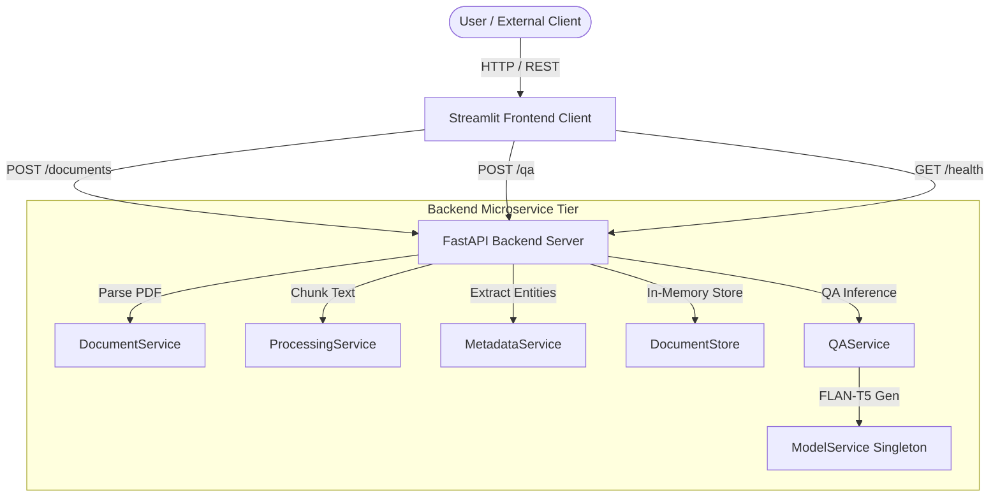

# 📖 SpectralReader - Document Intelligence Platform

[](https://www.python.org/)
[](https://fastapi.tiangolo.com/)
[](https://streamlit.io/)
[](https://www.docker.com/)
[](LICENSE)

**SpectralReader** is a production-grade Document Intelligence microservice and web application. It processes PDF documents, extracts text and structural sections, identifies key entities, retrieves candidate passages, and executes context-aware generative question answering powered by FLAN-T5 models.

---

## 🏛️ System Architecture

SpectralReader is designed around a decoupled client-service architecture. A **FastAPI REST API** serves as the single source of truth for business logic and ML inference, while a **Streamlit Web Application** functions as the official user interface.


```mermaid
graph TD
    User([User / External Client]) -->|HTTP / REST| Frontend[Streamlit Frontend Client]
    Frontend -->|POST /documents| API[FastAPI Backend Server]
    Frontend -->|POST /qa| API
    Frontend -->|GET /health| API

    subgraph Backend Microservice Tier
        API -->|Parse PDF| DocService[DocumentService]
        API -->|Chunk Text| ProcService[ProcessingService]
        API -->|Extract Entities| MetaService[MetadataService]
        API -->|In-Memory Store| Storage[DocumentStore]
        API -->|QA Inference| QAService[QAService]
        
        QAService -->|FLAN-T5 Gen| Models[ModelService Singleton]
    end
```

---

## 💡 Architecture Decisions

The architectural design of SpectralReader follows strict production microservice principles:

1. **FastAPI as Core Backend**:
   FastAPI was chosen for the backend due to its high performance, automatic request/response validation using Pydantic, built-in OpenAPI/Swagger documentation generation, and asynchronous request handling capabilities.
2. **Streamlit Retained as Official Frontend Client**:
   Streamlit provides an intuitive, responsive interface for document uploads and interactive analysis without adding frontend build complexity (e.g., Node/React tooling).
3. **Backend as Single Source of Truth**:
   All business logic (PDF parsing, text cleaning, chunking, entity extraction, model pre-warming, and QA generation) resides strictly within the backend services. The UI retains zero business or ML processing logic.
4. **Exclusive REST API Communication**:
   The Streamlit client communicates with the backend exclusively over HTTP REST endpoints. If the backend API service is offline, Streamlit displays an explicit notification prompting the operator to start the server rather than silently running local in-process fallback calls.
5. **Decoupled External Application Integration**:
   By exposing every capability over clean REST endpoints, external systems (mobile apps, enterprise workflows, CLI tools, automated batch pipelines) can consume the Document Intelligence microservice independently of the Streamlit frontend.

---

## ✨ Features

- 📄 **PDF Document Parsing**: Fast text extraction and page parsing via `pdfplumber`.
- 🧩 **Semantic Text Chunking**: Boundary-aware document splitting with configurable chunk size and overlap limits.
- 🏷️ **Entity Metadata Extraction**: Pattern-based entity recognition and frequency thresholding.
- 🔍 **Passage Retrieval & Search**: Candidate passage filtering across document chunks.
- 🧠 **Generative Question Answering**: Context-conditioned answer generation powered by FLAN-T5-Large.
- ⚡ **REST API Microservice**: Standardized JSON response payloads, Pydantic schemas, and global exception handling.
- 📊 **Health Probes & Metrics**: `/health` endpoint and `X-Process-Time` request timing headers.

---

## 🛠️ Technology Stack

| Layer | Component / Tool | Technology Used |
| :--- | :--- | :--- |
| **API Framework** | REST Endpoints, OpenAPI, Routing | FastAPI, Pydantic |
| **User Interface** | Web App Client | Streamlit |
| **Generative LLM** | Question Answering | FLAN-T5-Large (`google/flan-t5-large`) |
| **Embeddings & Reranking** | Vector Tools (Pre-configured) | MPNet Base, MiniLM CrossEncoder |
| **Document Processing** | PDF Parsing & Text Chunking | `pdfplumber`, `langchain-text-splitters` |
| **Deep Learning** | Model Execution & GPU/CPU Allocation | PyTorch, Hugging Face Transformers |
| **Containerization** | Multi-stage Docker Builds | Docker, Docker Compose |
| **Testing** | Automated Unit & Integration Suite | `pytest`, `pytest-cov`, `httpx` |

---

## 📂 Repository Structure

```
SpectralReader/
├── Dockerfile                  # Multi-stage Docker build file (Render ready)
├── .dockerignore               # Container context exclusions
├── docker-compose.yml          # Local container orchestration file
├── .env.example                # Deployment environment variable template
├── LICENSE                     # MIT License
├── README.md                   # Project documentation
├── app/                        # Application source code
│   ├── main_api.py             # FastAPI backend entry point
│   ├── main.py                 # Streamlit frontend client entry point
│   ├── requirements.txt        # Python dependency manifest
│   ├── api/                    # REST API Endpoint Routers
│   │   ├── health.py           # GET /health
│   │   ├── documents.py        # POST, GET, DELETE /documents
│   │   ├── search.py           # POST /search
│   │   └── qa.py               # POST /qa
│   ├── core/                   # Infrastructure Core
│   │   ├── config.py           # Deployment settings & constants
│   │   ├── exceptions.py       # Custom domain exceptions
│   │   └── logger.py           # Structured logger builder
│   ├── models/                 # Pydantic Schemas
│   │   └── schemas.py          # API request & response schemas
│   ├── services/               # Modular Business Logic
│   │   ├── document_service.py # PDF extraction
│   │   ├── processing_service.py # Text chunking
│   │   ├── metadata_service.py # Entity extraction
│   │   ├── model_service.py    # Singleton model container
│   │   └── qa_service.py       # FLAN-T5 QA engine
│   └── storage/                # Storage Tier
│       └── document_store.py   # In-memory document storage
└── tests/                      # Automated Testing Suite
    ├── conftest.py             # Pytest fixtures & ML model mocks
    ├── unit/                   # Service unit tests
    └── api/                    # API integration tests
```

---

## 🚀 Local Setup & Execution

### Prerequisites
- Python 3.12 or higher
- `pip` package manager

### 1. Installation
```bash
git clone https://github.com/ParminderSinghGithub/SpectralReader.git
cd SpectralReader
python -m venv venv

# On Windows
.\venv\Scripts\activate

# On Linux/macOS
source venv/bin/activate

pip install -r app/requirements.txt
```

### 2. Launch FastAPI Backend Service
```bash
uvicorn app.main_api:app --reload --host 0.0.0.0 --port 8000
```
The REST API will be accessible at `http://localhost:8000`.  
View interactive Swagger documentation at `http://localhost:8000/docs` and ReDoc at `http://localhost:8000/redoc`.

### 3. Launch Streamlit Frontend Client
In a separate terminal window:
```bash
# On Windows
.\venv\Scripts\activate

streamlit run app/main.py
```
The Streamlit interface will open at `http://localhost:8501`.

---

## 🐳 Docker Setup

### 1. Build and Run Container Locally
```bash
docker build -t spectralreader-api .
docker run -p 8000:8000 -e PORT=8000 spectralreader-api
```

### 2. Using Docker Compose
```bash
docker-compose up --build
```
Probes health status automatically via container health checks on `http://localhost:8000/health`.

---

## 🌐 Deployment Guide

### Deploying FastAPI Backend to Render
1. Sign in to [Render](https://render.com/) and click **New +** -> **Web Service**.
2. Connect your Git repository (`SpectralReader`).
3. Select **Docker** as the Runtime.
4. Set the following details:
   - **Name**: `spectralreader-api`
   - **Region**: Select your preferred region
   - **Branch**: `main`
5. Under **Environment Variables**, set:
   - `PORT` = `8000`
   - `LOG_LEVEL` = `INFO`
   - `CORS_ORIGINS` = `*`
6. Click **Create Web Service**. Render will automatically build the `Dockerfile`, expose the `$PORT`, and run health checks on `/health`.

### Deploying Streamlit Frontend to Streamlit Community Cloud
1. Sign in to [Streamlit Community Cloud](https://streamlit.io/cloud).
2. Click **New app**.
3. Select your repository (`SpectralReader`), branch (`main`), and set Main file path to:
   ```
   app/main.py
   ```
4. Under **Advanced settings...** -> **Secrets**, set your Render API backend URL:
   ```toml
   API_BASE_URL = "https://spectralreader-api.onrender.com"
   ```
5. Click **Deploy!**. The frontend client will connect to your Render backend REST API.

---

## ⚙️ Environment Variables Reference

| Variable | Type | Default | Description |
| :--- | :--- | :--- | :--- |
| `HOST` | String | `0.0.0.0` | IP binding interface address |
| `PORT` | Integer | `8000` | Port exposed by backend service |
| `LOG_LEVEL` | String | `INFO` | Logger verbosity (`DEBUG`, `INFO`, `WARNING`, `ERROR`) |
| `API_BASE_URL` | String | `http://localhost:8000` | Base URL used by Streamlit client |
| `CORS_ORIGINS` | String | `*` | Allowed CORS origins (comma-separated) |

---

## 📡 REST API Reference & cURL Examples

### 1. Health Check
```bash
curl -X GET "http://localhost:8000/health"
```
**Response**:
```json
{
  "status": "ok",
  "service": "SpectralReader Document Intelligence API",
  "version": "1.0.0",
  "models_loaded": true
}
```

### 2. Upload Document
```bash
curl -X POST "http://localhost:8000/documents" \
  -F "file=@/path/to/document.pdf"
```
**Response**:
```json
{
  "document_id": "a8b076a5-68ac-4908-90b8-034996d92155",
  "filename": "document.pdf",
  "num_pages": 12,
  "num_chunks": 8,
  "entities": ["Arthur Vance", "Elizabeth Swann"],
  "created_at": "2026-07-22T15:45:00Z"
}
```

### 3. Get Document Metadata
```bash
curl -X GET "http://localhost:8000/documents/a8b076a5-68ac-4908-90b8-034996d92155"
```

### 4. Search Candidate Passages
```bash
curl -X POST "http://localhost:8000/search" \
  -H "Content-Type: application/json" \
  -d '{
    "document_id": "a8b076a5-68ac-4908-90b8-034996d92155",
    "query": "What are the key findings?",
    "top_k": 3
  }'
```

### 5. Generative Question Answering
```bash
curl -X POST "http://localhost:8000/qa" \
  -H "Content-Type: application/json" \
  -d '{
    "document_id": "a8b076a5-68ac-4908-90b8-034996d92155",
    "question": "What is the primary conclusion of the report?"
  }'
```
**Response**:
```json
{
  "document_id": "a8b076a5-68ac-4908-90b8-034996d92155",
  "question": "What is the primary conclusion of the report?",
  "answer": "The report concludes that adaptive streaming significantly improves throughput.",
  "retrieved_context": ["Excerpt passage text..."],
  "processing_time_ms": 142.5
}
```

### 6. Delete Document
```bash
curl -X DELETE "http://localhost:8000/documents/a8b076a5-68ac-4908-90b8-034996d92155"
```

---

## 🧪 Automated Testing

Execute the test suite with coverage reporting:
```bash
pytest tests/ -v --cov=app --cov-report=term-missing
```

### Test Suite Highlights
- **23 Test Cases**: 100% pass rate in < 1 second.
- **Fast & Deterministic**: Heavy ML dependencies are mocked using `pytest` fixtures.
- **Full Coverage**: 100% statement coverage across core REST API routes and domain exception paths.

---

## 📜 License

Released under the **MIT License** — free for academic, personal, and commercial use. See [LICENSE](LICENSE) for details.
